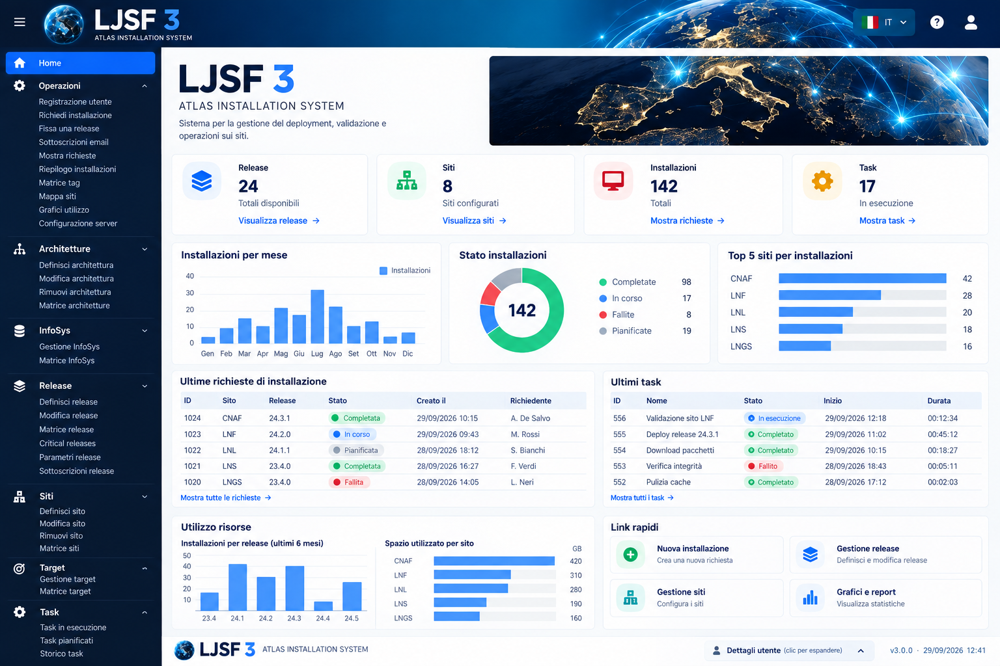
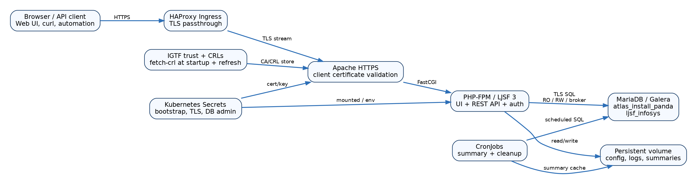
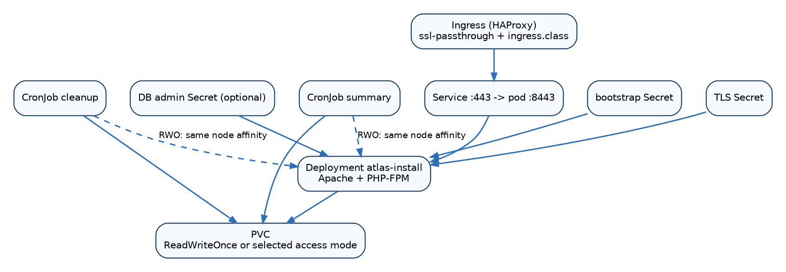
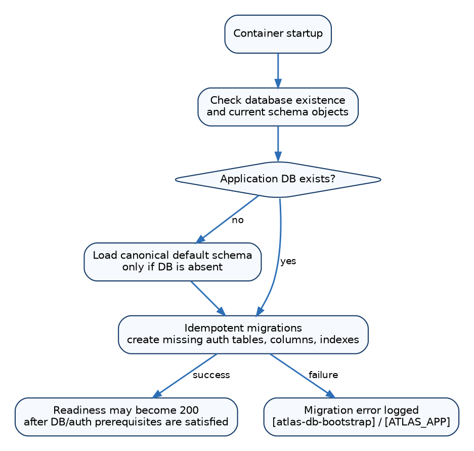
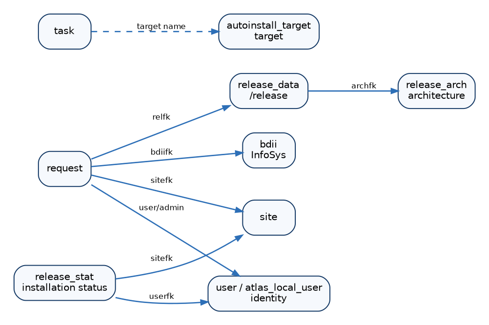
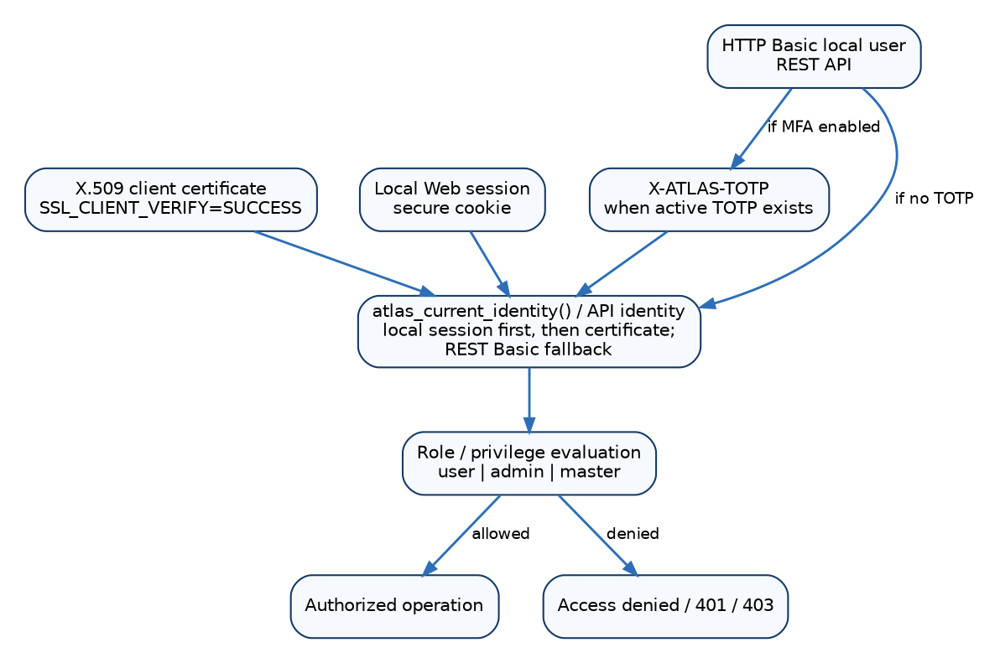
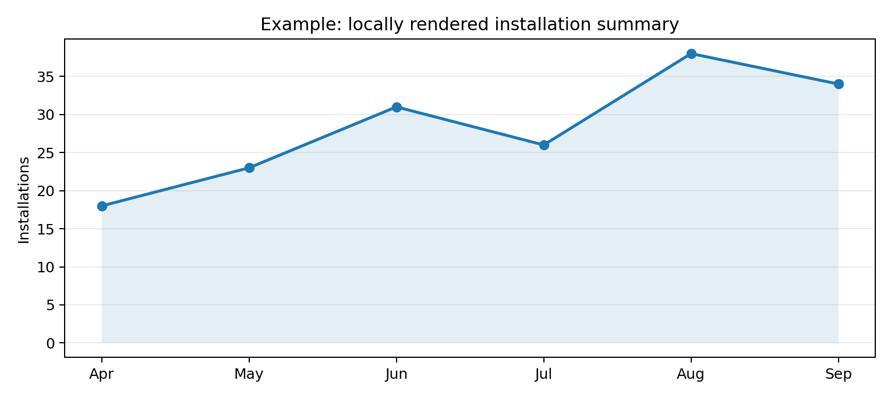
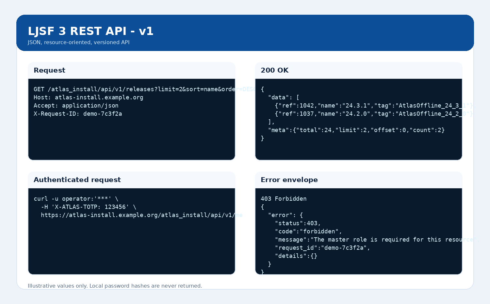
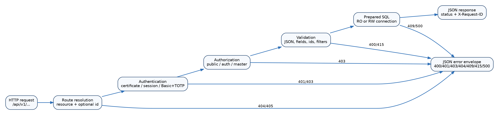

# LJSF 3 - ATLAS Installation System
## Manuale operativo e amministrativo completo


| Dato | Valore |
| --- | --- |
| Nome | LJSF 3 - ATLAS Installation System |
| Versione | 3.0.0 |
| Revisione pacchetto | r30 |
| Creatore / maintainer | Alessandro De Salvo |
| Licenza | EUPL-1.2 |
| Web root | `/atlas_install/` |
| REST API | `/atlas_install/api/v1/` |
| Piattaforma di riferimento | Rocky Linux 10 / PHP 8.3+ / Kubernetes / MariaDB-Galera |


> Questo manuale descrive il comportamento corrente dell’applicazione e non è un changelog. Gli esempi con hostname, utenti o dati applicativi sono illustrativi.

<div class="pagebreak"></div>

## Indice ragionato

1. Scopo e modello operativo
2. Architettura del sistema
3. Topologia Kubernetes e networking
4. Avvio del container e readiness
5. Configurazione e Secret
6. Database, schema e migrazioni
7. Autenticazione, ruoli e autorizzazione
8. TOTP e QR code
9. Navigazione Web e responsive UI
10. Release e architetture
11. Siti, InfoSys, target e task
12. Richieste di installazione
13. Stato installazioni e list.php
14. Grafici, summary e CronJob
15. Logging e osservabilità
16. REST API - modello e utilizzo
17. Sicurezza operativa
18. Backup, restore e compatibilità
19. Troubleshooting
20. Sviluppo e GitHub
21. Appendice A. Variabili di configurazione
22. Appendice B. Endpoint REST
23. Appendice C. Glossario

## 1. Scopo e modello operativo

LJSF 3 gestisce il ciclo di deployment software ATLAS: definizione delle release e delle architetture, anagrafica dei siti e delle risorse, richieste di installazione, task operativi, stato delle installazioni, sottoscrizioni, report e funzioni amministrative. L’applicazione preserva le interfacce legacy e aggiunge una REST API versionata per nuovi client.



*Screenshot illustrativo della UI LJSF 3 con dati dimostrativi.*


## 2. Architettura del sistema

Il browser o client API entra attraverso HAProxy Ingress in TLS passthrough. Apache termina TLS, valida opzionalmente/obbligatoriamente i certificati client secondo la path, e inoltra PHP a PHP-FPM. L’app usa connessioni MariaDB separate per lettura, scrittura e broker; il migratore può usare una credenziale amministrativa separata. Il volume persistente contiene configurazione gestita, log e summary.




## 3. Topologia Kubernetes e networking

Il Deployment espone HTTPS internamente sulla porta configurata e il Service pubblica 443. Per HAProxy il manifest deve contenere sia `spec.ingressClassName: haproxy` sia `kubernetes.io/ingress.class: haproxy`, oltre all’annotazione di SSL passthrough. Con PVC `ReadWriteOnce`, i CronJob che montano lo stesso volume vengono co-locati sul nodo del server.

### 3.1 Oggetti Kubernetes principali

- **Deployment**: esegue Apache e PHP-FPM, monta TLS, bootstrap/configurazione e PVC.
- **Service**: pubblica l’HTTPS del pod all’interno del cluster.
- **Ingress HAProxy**: effettua TLS passthrough; non deve terminare TLS se si vuole preservare il certificato client fino ad Apache.
- **PVC**: conserva configurazione gestita, log, cache e summary.
- **CronJob summary**: calcola dati aggregati usati dai grafici locali.
- **CronJob cleanup**: applica la retention ai log/archivi.
- **Secret bootstrap**: contiene configurazione e credenziali runtime.
- **Secret TLS**: certificato e chiave del server.
- **Secret DB admin**: opzionale, usato soltanto dal migratore schema.

### 3.2 Verifiche dopo un rollout

```bash
kubectl -n atlas-install rollout status deploy/atlas-install
kubectl -n atlas-install get pods -o wide
kubectl -n atlas-install get ingress,svc,pvc,cronjob
kubectl -n atlas-install get events --sort-by=.lastTimestamp | tail -50
```

Con storage RWO, verificare che i pod dei CronJob vengano schedulati sullo stesso nodo del server quando devono montare il medesimo PVC.




## 4. Avvio del container e readiness

1. sincronizzazione configurazione dal bootstrap Secret
2. chiave cifratura autenticazione locale
3. validazione certificato HTTPS
4. controllo/migrazione DB e schema auth
5. ripristino trust IGTF e fetch-crl iniziale
6. render/validazione Apache
7. avvio PHP-FPM
8. avvio Apache
`healthz.php` indica che il processo Web è vivo. `readyz.php` verifica anche la dipendenza DB; non confondere liveness con readiness.

### 4.1 Log di startup attesi

Il log deve rendere visibili le fasi di configurazione, migrazione DB, IGTF/fetch-crl, PHP-FPM e Apache. Un avvio sano consente di distinguere un errore di mount/Secret da un errore applicativo o DB.

```bash
kubectl logs -n atlas-install deploy/atlas-install --since=10m
```

Se il container non è mai partito, `kubectl logs` può essere vuoto: usare `kubectl describe pod` e gli eventi per individuare errori di mount, `Multi-Attach`, Secret mancanti o problemi di scheduling.

### 4.2 Probe manuali

```bash
kubectl -n atlas-install exec deploy/atlas-install -- \
  curl -fsS http://127.0.0.1/atlas_install/healthz.php

kubectl -n atlas-install exec deploy/atlas-install -- \
  curl -fsS http://127.0.0.1/atlas_install/readyz.php
```

## 5. Configurazione e Secret

Il bootstrap Secret è la sorgente autorevole di `atlas-install.env`. L’entrypoint sincronizza atomicamente il file persistente quando il Secret cambia. Password DB e chiavi TLS non devono essere salvate nello state locale del wizard. La credenziale DB admin per migrazioni è opzionale e separata dal normale `dbwriter`.

### 5.1 Wizard Kubernetes

Il wizard è idempotente: riusa le scelte non segrete come default, preserva le password esistenti se non vengono cambiate e riavvia il Deployment quando una modifica effettiva richiede il reload. Il wizard supporta TLS DB opzionale, dimensione/access mode del PVC, Ingress class, risorse CPU/memoria e credenziali DB separate.

Prima di applicare, è consigliato generare e revisionare i manifest. Dopo l’applicazione, verificare sempre il rollout e la readiness.

### 5.2 Configurazione DB TLS

Con `ATLAS_DB_SSL=1` tutte le connessioni applicative usano TLS. `ATLAS_DB_SSL_VERIFY=1` richiede anche la verifica del certificato server e `ATLAS_DB_SSL_CA` indica la CA. Per diagnosi, confrontare un test `mariadb --ssl` dal pod con il comportamento PHP.
Un Kubernetes Secret è base64, non automaticamente cifrato a riposo; la cifratura reale richiede encryption-at-rest nell’API server/etcd.

## 6. Database, schema e migrazioni

Le migrazioni di startup sono idempotenti: se viene ripristinato un dump precedente, l’app aggiunge gli oggetti mancanti richiesti dalla versione corrente (tabelle auth, colonne, indici e marker di migrazione) senza ricreare un database già presente. Lo schema completo canonico viene caricato solo quando il database applicativo è assente.

### 6.1 Separazione delle credenziali DB

- **RO**: letture, readiness e viste che non devono modificare dati.
- **RW**: normali operazioni applicative.
- **Broker**: compatibilità con componenti/azioni legacy che usano un canale dedicato.
- **Bootstrap/admin**: DDL e migrazione schema; non deve essere usato dal traffico applicativo ordinario.

### 6.2 Restore di un dump precedente

1. Ripristinare i dati nel cluster MariaDB/Galera.
2. Preservare/ricreare i Secret Kubernetes dell’applicazione.
3. Avviare il pod con `ATLAS_DB_AUTO_INIT=1`.
4. Controllare `[atlas-db-bootstrap]` e `[ATLAS_APP]` nei log.
5. Verificare tabelle auth, colonne e indici introdotti dopo il dump.
6. Verificare `readyz.php`.
7. Provare login locale e una pagina protetta.
8. Eseguire query di controllo su richieste/status prima di riaprire le scritture operative.

Il migratore non deve cancellare dati esistenti né ricreare tabelle sane.






## 7. Autenticazione, ruoli e autorizzazione

Sono supportati certificati client X.509 e account locali. I ruoli locali sono `user`, `admin`, `master`. Le pagine protette mantengono header/menu anche in caso di accesso negato e indicano login locale o certificato adeguato. Per compatibilità legacy, un account locale autenticato viene sincronizzato con un’identità `LOCAL:<username>` nella tabella storica `user`.

### 7.1 Matrice di accesso concettuale

| Identità | Letture pubbliche | Funzioni protette | Amministrazione utenti/configurazione |
| --- | --- | --- | --- |
| Non autenticato | Sì, dove previste | No | No |
| Certificato valido senza ruolo | Sì | No, finché non è mappato a un ruolo abilitato | No |
| Locale `user` | Sì | Funzioni consentite al ruolo | No |
| Locale/certificato `admin` | Sì | Operazioni amministrative ordinarie | Limitato secondo funzione |
| Locale/certificato `master` | Sì | Sì | Sì |

### 7.2 Certificati client

Apache riceve direttamente il certificato grazie al TLS passthrough. L’identità applicativa usa il DN normalizzato e consulta la tabella legacy `user`/`role`. Un certificato tecnicamente valido ma non mappato non concede automaticamente privilegi applicativi.




## 8. TOTP e QR code

Gli account locali possono registrare uno o più autenticatore TOTP. Il secret viene memorizzato cifrato; l’enrollment mostra sia la stringa Base32 sia un QR code generato localmente con URI `otpauth://`. Il QR non viene inviato a servizi esterni. La verifica accetta il time slice corrente e i due adiacenti per tollerare piccoli scarti di clock.

### 8.1 Enrollment TOTP

1. L’utente autenticato o il master avvia l’aggiunta dell’autenticatore.
2. L’app genera un secret casuale e lo cifra usando la chiave locale auth.
3. La pagina mostra secret Base32 e QR code.
4. L’utente acquisisce il QR con l’app Authenticator.
5. Un codice TOTP viene verificato prima di considerare l’autenticatore operativo.

Sincronizzare NTP sui dispositivi e sui nodi del cluster: errori di clock sono una causa frequente di TOTP non validi.

## 9. Navigazione Web e responsive UI

La lingua deriva dal browser (`it*` -> italiano, altrimenti inglese) ed è modificabile dal selettore. Su mobile il menu è un drawer verticale. Tabelle larghe vengono rese come record collassabili: chiuse mostrano i campi prioritari, aperte mostrano i dettagli verticalmente. Le viste browser usano paginazione predefinita 200; il limite non modifica API e query machine-oriented.

### 9.1 Principi responsive

- Nessun campo essenziale deve richiedere la rotazione del telefono.
- I menu mobili sono verticali e le singole voci occupano righe distinte.
- I record tabellari larghi vengono trasformati in card/riga espandibile.
- I controlli tecnici/hidden non vengono mostrati come campi della card.
- I dettagli dell’identità corrente sono collassati per default in fondo alla pagina.
- Form e filtri devono restare entro la larghezza del viewport.

### 9.2 Lingua

Il selettore chiama l’endpoint dedicato `lang.php`, memorizza la preferenza e torna alla pagina corrente. La Web UI, i messaggi di errore e la documentazione devono disporre di stringhe italiane e inglesi; l’inglese è il fallback per browser non italiani.

## 10. Release e architetture

Le release sono definite in `release_data`; le architetture in `release_arch`. Le funzioni protette consentono definizione, modifica e rimozione nel rispetto delle dipendenze DB. I campi principali includono nome/tag/pacchetto, architettura, flag obsolete/autoinstall, path software, criticità e finestre temporali.

## 11. Siti, InfoSys, target e task

I siti contengono identità ATLAS/grid, OS/architettura, filesystem, capacità e stato. InfoSys (`bdii`) conserva endpoint e flag di preferenza/abilitazione. I target definiscono destinazioni di auto-installazione; i task definiscono operazioni riutilizzabili. Le pagine legacy di definizione sono mantenute per compatibilità e protette da autorizzazione.

## 12. Richieste di installazione

`protected/req.php` visualizza e gestisce richieste. La query è paginata e ottimizzata con join espliciti e indici dedicati. Gli eventi di query lente sono tracciati come `slow_database_query`. Le richieste referenziano sito, release, tipo, richiedente, amministratore assegnato e stato.

### 12.1 Performance e timeout

Il conteggio e la selezione dati devono evitare join non necessari; gli indici su foreign key, status e date sono parte della migrazione schema. `ATLAS_DB_SLOW_QUERY_MS` controlla la soglia di logging. Aumentare `ATLAS_REQUEST_TIMEOUT_SECONDS` è un margine operativo, non un sostituto dell’ottimizzazione SQL.

### 12.2 Diagnosi

Cercare nei log i checkpoint `req_*` e gli eventi `slow_database_query`. Usare `EXPLAIN` sul database per query persistenti lente e verificare statistiche/cardinalità degli indici dopo import massivi.

## 13. Stato installazioni e list.php

`list.php` offre ricerca, filtri e ordinamento in una sezione collassabile. I record sono collassabili anche desktop: la riga chiusa mostra almeno Num, Release number, Site name e Release arch; i dettagli si espandono senza imporre scroll orizzontale. I colori storici di stato vengono mantenuti. Il footer e i dettagli identità sono separati dal frame dati.

## 14. Grafici, summary e CronJob

I CronJob non generano immagini tramite servizi esterni. Producono summary/cache; la Web UI renderizza i grafici localmente on-demand come SVG/HTML. Ciò riduce dipendenze esterne e rende il rendering deterministico nel cluster.




## 15. Logging e osservabilità

L’app scrive eventi strutturati `[ATLAS_APP]` con `request_id`, URI ed evento, senza password/secret. Il file persistente `/var/lib/atlas-install/log/php-application.log` viene seguito dall’entrypoint verso stderr, così `kubectl logs` riceve anche errori PHP-FPM. Eventi chiave: `php_error`, `uncaught_exception`, `http_5xx_completed`, `same_origin_rejected`, `slow_database_query`, eventi auth e checkpoint diagnostici delle pagine critiche.

### 15.1 Correlazione

Ogni richiesta Web/API riceve un request-id; se il client invia un `X-Request-ID` valido, viene riutilizzato. Per un errore 500 annotare il request-id mostrato/ritornato e cercarlo nei log. Questo riduce l’ambiguità quando più utenti generano errori contemporaneamente.

### 15.2 Comandi operativi

```bash
# stream completo
kubectl logs -n atlas-install deploy/atlas-install -f

# errori applicativi
kubectl logs -n atlas-install deploy/atlas-install --since=30m | grep '\[ATLAS_APP\]'

# log persistente direttamente dal pod
kubectl exec -n atlas-install deploy/atlas-install -- \
  tail -200 /var/lib/atlas-install/log/php-application.log
```
```bash
kubectl logs -n atlas-install deploy/atlas-install --since=10m -f
kubectl exec -n atlas-install deploy/atlas-install -- tail -100 /var/lib/atlas-install/log/php-application.log
```

## 16. REST API - modello e utilizzo

La REST API v1 è una superficie parallela agli endpoint legacy. Usa URI a risorse, JSON, metodi HTTP standard, status code e request-id. Per il riferimento completo consultare `REST-API.it.md`/`REST-API.en.md` e l’appendice API di questo manuale.




## 17. Sicurezza operativa

- TLS obbligatorio per traffico pubblico e API con credenziali.
- TLS database configurabile con verifica CA.
- Least privilege per RO/RW/broker/migrator.
- Non loggare password, token, TOTP o chiavi private.
- Mantenere IGTF/CRL aggiornati e verificare fetch-crl nei log startup.
- Abilitare encryption-at-rest dei Kubernetes Secret.
- Ruolo master solo a operatori/amministratori appropriati.
- Monitorare 401/403/5xx e query lente.

## 18. Backup, restore e compatibilità

Un restore può riportare il DB a uno schema precedente: il migratore di startup deve sempre essere lasciato attivo affinché ricrei tabelle/indici/colonne mancanti. Le migrazioni non devono cancellare dati. Prima di restore importanti, preservare Secret, TLS, PVC e configurazione; dopo il restore verificare readiness, log migratore, tabelle auth, indici e login locale.

### 18.1 Checklist pre-restore

- esportare/annotare Secret e configurazione non recuperabili dal dump DB;
- verificare il backup TLS e la chiave auth locale;
- documentare la versione applicativa da cui proviene il dump;
- sospendere o coordinare CronJob/scritture;
- verificare spazio libero e possibilità di rollback.

### 18.2 Checklist post-restore

- attendere migrazioni automatiche;
- controllare `readyz.php`;
- verificare autenticazione locale e certificato;
- controllare indici introdotti dalle revisioni recenti;
- verificare letture e scritture con un account non-master;
- controllare grafici/summary e riabilitare i CronJob.

## 19. Troubleshooting

| Sintomo | Verifica |
| --- | --- |
| Pod non Ready | Confrontare `/readyz.php`, log startup, TLS DB, auth schema e Secret bootstrap. |
| 500 Web | Usare `X-Request-ID` e cercare `[ATLAS_APP]`; controllare anche il file log persistente. |
| Login locale fallisce | Verificare account enabled, must-change-password, TOTP e tabella auth; non confondere con same-origin/CSRF. |
| Certificato negato | Verificare TLS passthrough, SSL_CLIENT_VERIFY, DN normalizzato e mapping `user`. |
| req.php lento | Cercare `slow_database_query`, verificare indici e cardinalità; non alzare il timeout come prima soluzione. |
| CronJob Pending con RWO | Verificare podAffinity sul nodo del server e Multi-Attach events. |
| Lingua errata | Verificare cookie/selettore `lang.php` e `Accept-Language`. |


## 20. Sviluppo e GitHub

Il repository canonico contiene Dockerfile/Containerfile, manifest Kubernetes, wizard, test statici e documentazione. Ogni revisione deve eseguire lint PHP/shell, parsing YAML, controlli Secret hygiene, test regressione UI/API e build multiarch in CI. Le modifiche al contratto REST v1 devono essere backward-compatible oppure introdurre una nuova versione API.


ewpage
## Appendice A. Variabili di configurazione principali

Le variabili seguenti costituiscono il contratto operativo principale tra wizard, Secret Kubernetes, entrypoint e applicazione. Le password sono riportate solo come nomi di variabile: non devono comparire nella documentazione di deployment, nei log o nei file di stato del wizard.

| Variabile | Scopo |
| --- | --- |
| `ATLAS_PUBLIC_HOSTNAME` | Public DNS hostname used by Apache/TLS and same-origin checks. |
| `ATLAS_HTTPS_PORT` | HTTPS port inside the container (normally 8443). |
| `ATLAS_ENV_FILE` | Managed runtime environment file path. |
| `ATLAS_BOOTSTRAP_ENV` | Mounted bootstrap Secret file used to refresh the managed env file. |
| `ATLAS_BOOTSTRAP_SYNC_SECONDS` | Interval used to detect bootstrap Secret changes. |
| `ATLAS_DB_NAME` | Application database name, normally atlas_install_panda. |
| `ATLAS_DB_RW_HOST / USER / PASSWORD` | Read-write database endpoint and credentials. |
| `ATLAS_DB_RO_HOST / USER / PASSWORD` | Read-only database endpoint and credentials. |
| `ATLAS_DB_BROKER_HOST / USER / PASSWORD` | Broker/legacy execution database endpoint and credentials. |
| `ATLAS_DB_BOOTSTRAP_USER / PASSWORD` | Optional privileged credential used by startup schema migration. |
| `ATLAS_DB_AUTO_INIT` | Enable idempotent application/auth schema initialization at startup. |
| `ATLAS_DB_SSL` | Enable TLS for MariaDB connections. |
| `ATLAS_DB_SSL_VERIFY` | Enable server-certificate verification for DB TLS. |
| `ATLAS_DB_SSL_CA` | CA bundle/path used to verify the MariaDB server certificate. |
| `ATLAS_DB_SLOW_QUERY_MS` | Threshold for slow_database_query logging. |
| `ATLAS_REQUEST_TIMEOUT_SECONDS` | Application-side timeout margin for long protected request pages. |
| `ATLAS_TLS_CERT_FILE` | Server certificate/full-chain file mounted in the container. |
| `ATLAS_TLS_KEY_FILE` | Server private key file mounted in the container. |
| `ATLAS_IGTF_DIR` | Active IGTF trust-anchor/CRL directory. |
| `ATLAS_IGTF_CACHE_DIR` | Cache used by IGTF refresh logic. |
| `ATLAS_IGTF_REFRESH_SECONDS` | Periodic IGTF/CRL refresh interval. |
| `ATLAS_CRL_MAX_AGE_SECONDS` | Maximum accepted CRL age. |
| `ATLAS_CRL_FETCH_TIMEOUT_SECONDS` | Timeout used for CRL retrieval. |
| `ATLAS_LOCAL_AUTH_KEY_FILE` | Local-auth encryption key file for encrypted TOTP secrets. |
| `ATLAS_APP_ERROR_LOG` | Persistent PHP/application log path tailed into container stderr. |
| `ATLAS_UPLOAD_PATH` | Persistent upload/data path. |
| `ATLAS_ARCHIVE_PATH` | Archive/log backup path. |
| `ATLAS_CACHE_PATH` | Application cache path. |
| `ATLAS_KML_CACHE` | KML cache path. |
| `ATLAS_VO` | VO label, normally ATLAS. |
| `ATLAS_EMAIL` | Application sender/contact email setting. |
| `ATLAS_CONTACTS` | Installation-team contact string. |
| `ATLAS_DEFAULT_INFOSYS` | Default InfoSys/BDII endpoint. |
| `ATLAS_ACTIVITY_PERIOD` | Default activity period used by legacy views. |
| `ATLAS_DEBUG` | Enable verbose diagnostic behavior; not for normal production use. |

Le variabili legacy specifiche dell'agente software possono essere presenti per compatibilità, ma non vanno confuse con la configurazione del server Web. Prima di modificare un valore in produzione, verificare se è gestito dal wizard e quindi riscritto dal bootstrap Secret.

## Appendice B. REST API - riferimento completo

> Documento normativo per la superficie REST API v1 inclusa nel pacchetto r30. Gli endpoint legacy restano disponibili ma non fanno parte del contratto REST.

## 1. Identità del servizio

- **Product:** LJSF 3 - ATLAS Installation System
- **Application version:** 3.0.0
- **Package revision:** r30
- **Base path:** `/atlas_install/api/v1`
- **Media type:** `application/json; charset=UTF-8`
- **Response cache:** `Cache-Control: no-store`
- **API version header:** `X-API-Version: v1`
- **Request correlation:** `X-Request-ID`



*Figura: ciclo di vita di una richiesta REST.*

## 2. Modello di autenticazione

Le API riutilizzano il modello di identità dell’applicazione. L’identità viene risolta nell’ordine seguente: sessione locale Web già valida; certificato client X.509 valido; come fallback specifico REST, HTTP Basic con account locale. Se un account locale dispone di almeno un TOTP attivo, l’accesso Basic richiede anche l’header `X-ATLAS-TOTP`.


| Meccanismo | Trasporto | Requisiti | Note |
| --- | --- | --- | --- |
| Certificato X.509 | TLS client certificate | Il TLS deve arrivare ad Apache; `SSL_CLIENT_VERIFY=SUCCESS`; il DN deve essere mappato nella tabella `user`. | Adatto ad automazione con certificati personali/robot. |
| Sessione locale | Cookie Web sicuro | Sessione locale non scaduta e account abilitato. | Utile a chiamate effettuate dal browser già autenticato. |
| HTTP Basic | `Authorization: Basic ...` | Account locale abilitato, password corretta, `must_change_password=0`. | Usare esclusivamente su HTTPS. |
| Basic + TOTP | Basic + `X-ATLAS-TOTP: 123456` | Obbligatorio se l’account dispone di TOTP attivi. | Il codice è 6 cifre; la finestra TOTP accetta lo slice corrente +/- 1. |

### 2.1 Esempi di autenticazione

```bash
# Basic senza TOTP
curl --fail-with-body -u operator:'PASSWORD' \
  https://atlas-install.example.org/atlas_install/api/v1/me

# Basic con TOTP
curl --fail-with-body -u operator:'PASSWORD' \
  -H 'X-ATLAS-TOTP: 123456' \
  https://atlas-install.example.org/atlas_install/api/v1/me

# X.509
curl --fail-with-body --cert client.pem --key client.key \
  https://atlas-install.example.org/atlas_install/api/v1/me
```

### 2.2 Errori di autenticazione

- `401 authentication_required`: nessuna identità valida. La risposta include `WWW-Authenticate: Basic realm="LJSF 3 REST API"`.
- `401 totp_required`: account Basic valido ma manca/è errato il TOTP.
- `403 password_change_required`: l’account locale deve cambiare password tramite Web UI prima di usare l’API.
- `403 forbidden`: autenticazione valida ma ruolo insufficiente.

## 3. Convenzioni HTTP e JSON

| Elemento | Comportamento |
| --- | --- |
| GET collection | `200` with `{data:[...], meta:{resource,total,limit,offset,count}}` |
| GET item | `200` with `{data:{...}}`; `404` if not found |
| POST collection | Requires JSON body; `201 Created`; `Location` header; response contains created id and location |
| PATCH item | Partial update; `200` with the updated resource |
| PUT item | Currently has the same supplied-field partial-update semantics as PATCH; it is not a full replacement |
| DELETE item | `204 No Content`; `404` if missing; `409` on database conflicts |
| OPTIONS | Returns supported method names; router advertises GET, HEAD, POST, PUT, PATCH, DELETE, OPTIONS |
| HEAD | Accepted on read routes; web server may suppress the body as required by HTTP |
| Content-Type | POST/PUT/PATCH with a non-empty body require `application/json`; otherwise `415` |
| Unknown JSON field | `400 unknown_field`; immutable keys are also rejected on update |
| Arrays/objects in fields | Rejected with `400 invalid_field`; resource fields are scalar |
| Caching | All API responses send `Cache-Control: no-store` |

### 3.1 Busta di errore

```json
{
  "error": {
    "status": 400,
    "code": "invalid_request",
    "message": "...",
    "request_id": "7c3f2a9b...",
    "details": {}
  }
}
```

### 3.2 Codici di ritorno

| HTTP | Nome | Significato |
| --- | --- | --- |
| 200 | OK | Lettura o aggiornamento riuscito. |
| 201 | Created | Creazione riuscita; usare `Location`. |
| 204 | No Content | Eliminazione riuscita. |
| 400 | Bad Request | ID/JSON/campo/query non valido. |
| 401 | Unauthorized | Autenticazione assente o TOTP richiesto. |
| 403 | Forbidden | Ruolo insufficiente o cambio password richiesto. |
| 404 | Not Found | Route, risorsa o record inesistente. |
| 405 | Method Not Allowed | Metodo non supportato dalla route. |
| 409 | Conflict | Conflitto/vincolo DB durante write/delete. |
| 415 | Unsupported Media Type | Body non JSON. |
| 500 | Internal Server Error | Errore interno; correlare con `request_id` nei log. |


## 4. Collezioni, filtri, ricerca, paginazione e ordinamento

Ogni campo esposto dalla risorsa può essere passato come query parameter per un confronto esatto (`field=value`). Il parametro `q` effettua una ricerca `LIKE %q%` esclusivamente sui campi elencati come *search fields*. `limit` ha default 200 e massimo 1000; `offset` non può essere negativo. `sort` deve essere uno dei campi esposti, altrimenti viene usata la chiave primaria; `order` accetta `ASC` o `DESC`, altrimenti `ASC`.

```bash
curl 'https://atlas-install.example.org/atlas_install/api/v1/releases?limit=100&offset=0&sort=name&order=DESC&q=24.3'
```

## 5. Matrice delle risorse

| Resource | DB table | Key | GET | Write | `q` fields |
| --- | --- | --- | --- | --- | --- |
| releases | release_data | ref | pubblico | utente autenticato | name, tag, package, comments |
| sites | site | ref | pubblico | utente autenticato | cs, cename, name, atlas_name, alias, arch |
| requests | request | id | utente autenticato | utente autenticato | id, user_comments, admin_comments |
| tasks | task | ref | pubblico | utente autenticato | name, description, target |
| architectures | release_arch | ref | pubblico | utente autenticato | platform_type, os_type, gcc_ver, mode, description |
| targets | autoinstall_target | ref | pubblico | utente autenticato | name, description |
| infosys | bdii | ref | pubblico | utente autenticato | hostname, ns, lb, ld, wmproxy, myproxy |
| release-subscriptions | release_subscription | ref | utente autenticato | utente autenticato | sitename, pattern, comment |
| release-status | release_stat | ref | pubblico | utente autenticato | name, tag, status, comments |
| grids | grid | ref | pubblico | utente autenticato | name, description |
| facilities | facility | ref | pubblico | utente autenticato | name, description |
| site-types | site_type | ref | pubblico | utente autenticato | name, description |
| request-statuses | request_status | ref | pubblico | ruolo master | description |
| request-types | request_type | ref | pubblico | ruolo master | field, description, comment |
| users | user | ref | ruolo master | ruolo master | name, dn, email |
| local-users | atlas_local_user | id | ruolo master | ruolo master | username, first_name, last_name, email, role |


## 6. Endpoint speciali

### `GET /`
Restituisce nome API, versione, URL documentazione e elenco risorse.

### `GET /health`
Health dell’API, non equivalente alla readiness applicativa completa. Risposta: `{"status":"ok","api":"v1","request_id":"..."}`.

### `GET /me`
Richiede autenticazione e restituisce l’identità effettiva. `password_hash` viene sempre rimosso.

### `GET /openapi`
Restituisce un documento OpenAPI 3.1 sintetico con path e metodi; il presente manuale è il riferimento più dettagliato per campi, autenticazione e semantica.


## 7. Riferimento completo delle risorse

### 7.1 `releases`

**Tabella DB:** `release_data`  
**Chiave:** `ref` (integer)  
**Lettura:** pubblico  
**Scrittura:** utente autenticato  
**Campi di ricerca `q`:** `name, tag, package, comments`

**Metodi:**

- `GET /releases`
- `GET /releases/{id}`
- `POST /releases`
- `PATCH /releases/{id}`
- `PUT /releases/{id}`
- `DELETE /releases/{id}`

**Campi esposti:**

| Field | DB type | Nullable | Scrivibile | Descrizione |
| --- | --- | --- | --- | --- |
| ref | int(11) | NO | no | Identificatore numerico della risorsa. |
| name | varchar(50) | NO | yes | Nome canonico o nome visualizzato. |
| build | varchar(15) | YES | yes | Campo canonico dello schema applicativo; il significato operativo dipende dalla risorsa. |
| typefk | int(11) | NO | yes | Riferimento al tipo. |
| archfk | int(11) | NO | yes | Campo canonico dello schema applicativo; il significato operativo dipende dalla risorsa. |
| sw_archfk | int(11) | YES | yes | Campo canonico dello schema applicativo; il significato operativo dipende dalla risorsa. |
| userfk | int(11) | NO | yes | Riferimento all’utente. |
| obsolete | int(11) | YES | yes | Flag di release obsoleta. |
| autoinstall | int(11) | YES | yes | Flag per auto-installazione. |
| requires | varchar(30) | YES | yes | Campo canonico dello schema applicativo; il significato operativo dipende dalla risorsa. |
| dbrelease | varchar(10) | YES | yes | Campo canonico dello schema applicativo; il significato operativo dipende dalla risorsa. |
| installer_version | varchar(10) | YES | yes | Campo canonico dello schema applicativo; il significato operativo dipende dalla risorsa. |
| install_tools_version | varchar(10) | YES | yes | Campo canonico dello schema applicativo; il significato operativo dipende dalla risorsa. |
| sw_name | varchar(255) | YES | yes | Campo canonico dello schema applicativo; il significato operativo dipende dalla risorsa. |
| sw_revision | varchar(20) | YES | yes | Campo canonico dello schema applicativo; il significato operativo dipende dalla risorsa. |
| sw_physicalpath | varchar(255) | NO | yes | Campo canonico dello schema applicativo; il significato operativo dipende dalla risorsa. |
| sw_logicalpath | varchar(255) | NO | yes | Campo canonico dello schema applicativo; il significato operativo dipende dalla risorsa. |
| tag | varchar(100) | NO | yes | Tag software/release. |
| package | varchar(255) | NO | yes | Pacchetto o descrittore del software. |
| comments | varchar(255) | YES | yes | Commenti operativi. |
| date | datetime | NO | yes | Data/ora associata al record. |
| cvmfs_available | int(11) | NO | yes | Campo canonico dello schema applicativo; il significato operativo dipende dalla risorsa. |
| critical | int(11) | NO | yes | Flag di release critica. |
| critical_validity_from | datetime | YES | yes | Campo canonico dello schema applicativo; il significato operativo dipende dalla risorsa. |
| critical_validity_to | datetime | YES | yes | Campo canonico dello schema applicativo; il significato operativo dipende dalla risorsa. |
| critical_description | varchar(25) | YES | yes | Campo canonico dello schema applicativo; il significato operativo dipende dalla risorsa. |


**Esempi:**

```bash
curl https://atlas-install.example.org/atlas_install/api/v1/releases?limit=20&offset=0
curl https://atlas-install.example.org/atlas_install/api/v1/releases/123
```

### 7.2 `sites`

**Tabella DB:** `site`  
**Chiave:** `ref` (integer)  
**Lettura:** pubblico  
**Scrittura:** utente autenticato  
**Campi di ricerca `q`:** `cs, cename, name, atlas_name, alias, arch`

**Metodi:**

- `GET /sites`
- `GET /sites/{id}`
- `POST /sites`
- `PATCH /sites/{id}`
- `PUT /sites/{id}`
- `DELETE /sites/{id}`

**Campi esposti:**

| Field | DB type | Nullable | Scrivibile | Descrizione |
| --- | --- | --- | --- | --- |
| ref | int(11) | NO | no | Identificatore numerico della risorsa. |
| cs | varchar(128) | NO | yes | Computer service/identificatore legacy. |
| cename | varchar(50) | NO | yes | Nome CE legacy. |
| name | varchar(30) | NO | yes | Nome canonico o nome visualizzato. |
| atlas_name | varchar(30) | NO | yes | Nome ATLAS del sito. |
| tier_level | int(11) | NO | yes | Livello/tier del sito. |
| gridfk | int(11) | NO | yes | Riferimento alla grid. |
| facilityfk | int(11) | YES | yes | Riferimento alla facility. |
| activity_typefk | int(11) | YES | yes | Riferimento al tipo attività. |
| osname | varchar(128) | NO | yes | Nome OS. |
| osrelease | varchar(128) | NO | yes | Release OS. |
| osversion | varchar(128) | NO | yes | Versione OS. |
| arch | varchar(20) | NO | yes | Architettura riportata dal sito. |
| tags | varchar(255) | YES | yes | Campo canonico dello schema applicativo; il significato operativo dipende dalla risorsa. |
| alias | varchar(128) | YES | yes | Campo canonico dello schema applicativo; il significato operativo dipende dalla risorsa. |
| swarea | varchar(255) | YES | yes | Campo canonico dello schema applicativo; il significato operativo dipende dalla risorsa. |
| fstype | varchar(15) | YES | yes | Tipo filesystem. |
| mountpoint | varchar(255) | YES | yes | Mount point. |
| capacity | int(11) | YES | yes | Capacità. |
| available | int(11) | YES | yes | Spazio disponibile. |
| quota | int(11) | YES | yes | Quota. |
| status | int(11) | YES | yes | Stato applicativo. |
| attr | int(10) | NO | yes | Campo canonico dello schema applicativo; il significato operativo dipende dalla risorsa. |
| host_status | int(11) | NO | yes | Campo canonico dello schema applicativo; il significato operativo dipende dalla risorsa. |
| resource_status | int(11) | NO | yes | Campo canonico dello schema applicativo; il significato operativo dipende dalla risorsa. |
| last_activity | timestamp | YES | yes | Ultima attività registrata. |


**Esempi:**

```bash
curl https://atlas-install.example.org/atlas_install/api/v1/sites?limit=20&offset=0
curl https://atlas-install.example.org/atlas_install/api/v1/sites/123
```

### 7.3 `requests`

**Tabella DB:** `request`  
**Chiave:** `id` (string)  
**Lettura:** utente autenticato  
**Scrittura:** utente autenticato  
**Campi di ricerca `q`:** `id, user_comments, admin_comments`

**Metodi:**

- `GET /requests`
- `GET /requests/{id}`
- `POST /requests`
- `PATCH /requests/{id}`
- `PUT /requests/{id}`
- `DELETE /requests/{id}`

**Campi esposti:**

| Field | DB type | Nullable | Scrivibile | Descrizione |
| --- | --- | --- | --- | --- |
| id | varchar(128) | NO | no | Identificatore della risorsa. |
| bdiifk | int(11) | NO | yes | Campo canonico dello schema applicativo; il significato operativo dipende dalla risorsa. |
| sitefk | int(11) | NO | yes | Riferimento al sito. |
| relfk | int(11) | NO | yes | Riferimento alla release. |
| typefk | int(11) | NO | yes | Riferimento al tipo. |
| userfk | int(11) | NO | yes | Riferimento all’utente. |
| adminfk | int(11) | YES | yes | Riferimento all’amministratore/operatore assegnato. |
| statusfk | int(11) | NO | yes | Riferimento allo stato della richiesta. |
| force_run | int(11) | NO | yes | Flag per forzare l’esecuzione. |
| request_date | datetime | YES | yes | Data/ora della richiesta. |
| update_date | datetime | YES | yes | Data/ora dell’ultimo aggiornamento. |
| user_comments | varchar(255) | YES | yes | Commenti inseriti dall’utente. |
| admin_comments | varchar(255) | YES | yes | Commenti amministrativi. |


**Esempi:**

```bash
curl https://atlas-install.example.org/atlas_install/api/v1/requests?limit=20&offset=0
curl https://atlas-install.example.org/atlas_install/api/v1/requests/REQ-EXAMPLE-001
```

### 7.4 `tasks`

**Tabella DB:** `task`  
**Chiave:** `ref` (integer)  
**Lettura:** pubblico  
**Scrittura:** utente autenticato  
**Campi di ricerca `q`:** `name, description, target`

**Metodi:**

- `GET /tasks`
- `GET /tasks/{id}`
- `POST /tasks`
- `PATCH /tasks/{id}`
- `PUT /tasks/{id}`
- `DELETE /tasks/{id}`

**Campi esposti:**

| Field | DB type | Nullable | Scrivibile | Descrizione |
| --- | --- | --- | --- | --- |
| ref | int(11) | NO | no | Identificatore numerico della risorsa. |
| name | varchar(50) | NO | yes | Nome canonico o nome visualizzato. |
| description | varchar(255) | YES | yes | Descrizione testuale. |
| target | varchar(20) | YES | yes | Target associato al task. |


**Esempi:**

```bash
curl https://atlas-install.example.org/atlas_install/api/v1/tasks?limit=20&offset=0
curl https://atlas-install.example.org/atlas_install/api/v1/tasks/123
```

### 7.5 `architectures`

**Tabella DB:** `release_arch`  
**Chiave:** `ref` (integer)  
**Lettura:** pubblico  
**Scrittura:** utente autenticato  
**Campi di ricerca `q`:** `platform_type, os_type, gcc_ver, mode, description`

**Metodi:**

- `GET /architectures`
- `GET /architectures/{id}`
- `POST /architectures`
- `PATCH /architectures/{id}`
- `PUT /architectures/{id}`
- `DELETE /architectures/{id}`

**Campi esposti:**

| Field | DB type | Nullable | Scrivibile | Descrizione |
| --- | --- | --- | --- | --- |
| ref | int(11) | NO | no | Identificatore numerico della risorsa. |
| platform_type | varchar(16) | NO | yes | Tipo di piattaforma. |
| os_type | varchar(128) | NO | yes | Sistema operativo. |
| gcc_ver | varchar(128) | NO | yes | Versione/toolchain GCC. |
| mode | varchar(10) | NO | yes | Modalità di build. |
| description | varchar(255) | NO | yes | Descrizione testuale. |


**Esempi:**

```bash
curl https://atlas-install.example.org/atlas_install/api/v1/architectures?limit=20&offset=0
curl https://atlas-install.example.org/atlas_install/api/v1/architectures/123
```

### 7.6 `targets`

**Tabella DB:** `autoinstall_target`  
**Chiave:** `ref` (integer)  
**Lettura:** pubblico  
**Scrittura:** utente autenticato  
**Campi di ricerca `q`:** `name, description`

**Metodi:**

- `GET /targets`
- `GET /targets/{id}`
- `POST /targets`
- `PATCH /targets/{id}`
- `PUT /targets/{id}`
- `DELETE /targets/{id}`

**Campi esposti:**

| Field | DB type | Nullable | Scrivibile | Descrizione |
| --- | --- | --- | --- | --- |
| ref | int(11) | NO | no | Identificatore numerico della risorsa. |
| name | varchar(15) | NO | yes | Nome canonico o nome visualizzato. |
| description | varchar(255) | YES | yes | Descrizione testuale. |


**Esempi:**

```bash
curl https://atlas-install.example.org/atlas_install/api/v1/targets?limit=20&offset=0
curl https://atlas-install.example.org/atlas_install/api/v1/targets/123
```

### 7.7 `infosys`

**Tabella DB:** `bdii`  
**Chiave:** `ref` (integer)  
**Lettura:** pubblico  
**Scrittura:** utente autenticato  
**Campi di ricerca `q`:** `hostname, ns, lb, ld, wmproxy, myproxy`

**Metodi:**

- `GET /infosys`
- `GET /infosys/{id}`
- `POST /infosys`
- `PATCH /infosys/{id}`
- `PUT /infosys/{id}`
- `DELETE /infosys/{id}`

**Campi esposti:**

| Field | DB type | Nullable | Scrivibile | Descrizione |
| --- | --- | --- | --- | --- |
| ref | int(11) | NO | no | Identificatore numerico della risorsa. |
| facilityfk | int(11) | NO | yes | Riferimento alla facility. |
| hostname | varchar(128) | NO | yes | Nome host. |
| port | int(11) | NO | yes | Porta TCP. |
| ns | varchar(255) | YES | yes | Campo canonico dello schema applicativo; il significato operativo dipende dalla risorsa. |
| lb | varchar(255) | YES | yes | Campo canonico dello schema applicativo; il significato operativo dipende dalla risorsa. |
| ld | varchar(255) | YES | yes | Campo canonico dello schema applicativo; il significato operativo dipende dalla risorsa. |
| wmproxy | varchar(255) | YES | yes | Campo canonico dello schema applicativo; il significato operativo dipende dalla risorsa. |
| myproxy | varchar(255) | YES | yes | Campo canonico dello schema applicativo; il significato operativo dipende dalla risorsa. |
| preferred | int(11) | NO | yes | Flag di preferenza. |
| enabled | int(11) | NO | yes | Flag di abilitazione (0/1). |


**Esempi:**

```bash
curl https://atlas-install.example.org/atlas_install/api/v1/infosys?limit=20&offset=0
curl https://atlas-install.example.org/atlas_install/api/v1/infosys/123
```

### 7.8 `release-subscriptions`

**Tabella DB:** `release_subscription`  
**Chiave:** `ref` (integer)  
**Lettura:** utente autenticato  
**Scrittura:** utente autenticato  
**Campi di ricerca `q`:** `sitename, pattern, comment`

**Metodi:**

- `GET /release-subscriptions`
- `GET /release-subscriptions/{id}`
- `POST /release-subscriptions`
- `PATCH /release-subscriptions/{id}`
- `PUT /release-subscriptions/{id}`
- `DELETE /release-subscriptions/{id}`

**Campi esposti:**

| Field | DB type | Nullable | Scrivibile | Descrizione |
| --- | --- | --- | --- | --- |
| ref | int(11) | NO | no | Identificatore numerico della risorsa. |
| sitename | varchar(50) | NO | yes | Nome sito. |
| userfk | int(11) | NO | yes | Riferimento all’utente. |
| pattern | varchar(50) | NO | yes | Pattern di sottoscrizione. |
| date | datetime | NO | yes | Data/ora associata al record. |
| comment | varchar(255) | YES | yes | Campo canonico dello schema applicativo; il significato operativo dipende dalla risorsa. |


**Esempi:**

```bash
curl https://atlas-install.example.org/atlas_install/api/v1/release-subscriptions?limit=20&offset=0
curl https://atlas-install.example.org/atlas_install/api/v1/release-subscriptions/123
```

### 7.9 `release-status`

**Tabella DB:** `release_stat`  
**Chiave:** `ref` (integer)  
**Lettura:** pubblico  
**Scrittura:** utente autenticato  
**Campi di ricerca `q`:** `name, tag, status, comments`

**Metodi:**

- `GET /release-status`
- `GET /release-status/{id}`
- `POST /release-status`
- `PATCH /release-status/{id}`
- `PUT /release-status/{id}`
- `DELETE /release-status/{id}`

**Campi esposti:**

| Field | DB type | Nullable | Scrivibile | Descrizione |
| --- | --- | --- | --- | --- |
| ref | int(11) | NO | no | Identificatore numerico della risorsa. |
| sitefk | int(11) | NO | yes | Riferimento al sito. |
| name | varchar(50) | NO | yes | Nome canonico o nome visualizzato. |
| userfk | int(11) | NO | yes | Riferimento all’utente. |
| pin | int(11) | YES | yes | Flag pin. |
| pinuserfk | int(11) | YES | yes | Utente che ha effettuato il pin. |
| pindate | datetime | YES | yes | Data pin. |
| tag | varchar(100) | NO | yes | Tag software/release. |
| status | varchar(100) | NO | yes | Stato applicativo. |
| comments | varchar(255) | YES | yes | Commenti operativi. |
| date | datetime | NO | yes | Data/ora associata al record. |


**Esempi:**

```bash
curl https://atlas-install.example.org/atlas_install/api/v1/release-status?limit=20&offset=0
curl https://atlas-install.example.org/atlas_install/api/v1/release-status/123
```

### 7.10 `grids`

**Tabella DB:** `grid`  
**Chiave:** `ref` (integer)  
**Lettura:** pubblico  
**Scrittura:** utente autenticato  
**Campi di ricerca `q`:** `name, description`

**Metodi:**

- `GET /grids`
- `GET /grids/{id}`
- `POST /grids`
- `PATCH /grids/{id}`
- `PUT /grids/{id}`
- `DELETE /grids/{id}`

**Campi esposti:**

| Field | DB type | Nullable | Scrivibile | Descrizione |
| --- | --- | --- | --- | --- |
| ref | int(11) | NO | no | Identificatore numerico della risorsa. |
| name | varchar(10) | NO | yes | Nome canonico o nome visualizzato. |
| description | varchar(255) | YES | yes | Descrizione testuale. |


**Esempi:**

```bash
curl https://atlas-install.example.org/atlas_install/api/v1/grids?limit=20&offset=0
curl https://atlas-install.example.org/atlas_install/api/v1/grids/123
```

### 7.11 `facilities`

**Tabella DB:** `facility`  
**Chiave:** `ref` (integer)  
**Lettura:** pubblico  
**Scrittura:** utente autenticato  
**Campi di ricerca `q`:** `name, description`

**Metodi:**

- `GET /facilities`
- `GET /facilities/{id}`
- `POST /facilities`
- `PATCH /facilities/{id}`
- `PUT /facilities/{id}`
- `DELETE /facilities/{id}`

**Campi esposti:**

| Field | DB type | Nullable | Scrivibile | Descrizione |
| --- | --- | --- | --- | --- |
| ref | int(11) | NO | no | Identificatore numerico della risorsa. |
| name | varchar(10) | NO | yes | Nome canonico o nome visualizzato. |
| description | varchar(255) | YES | yes | Descrizione testuale. |


**Esempi:**

```bash
curl https://atlas-install.example.org/atlas_install/api/v1/facilities?limit=20&offset=0
curl https://atlas-install.example.org/atlas_install/api/v1/facilities/123
```

### 7.12 `site-types`

**Tabella DB:** `site_type`  
**Chiave:** `ref` (integer)  
**Lettura:** pubblico  
**Scrittura:** utente autenticato  
**Campi di ricerca `q`:** `name, description`

**Metodi:**

- `GET /site-types`
- `GET /site-types/{id}`
- `POST /site-types`
- `PATCH /site-types/{id}`
- `PUT /site-types/{id}`
- `DELETE /site-types/{id}`

**Campi esposti:**

| Field | DB type | Nullable | Scrivibile | Descrizione |
| --- | --- | --- | --- | --- |
| ref | int(11) | NO | no | Identificatore numerico della risorsa. |
| name | varchar(50) | NO | yes | Nome canonico o nome visualizzato. |
| description | varchar(255) | NO | yes | Descrizione testuale. |


**Esempi:**

```bash
curl https://atlas-install.example.org/atlas_install/api/v1/site-types?limit=20&offset=0
curl https://atlas-install.example.org/atlas_install/api/v1/site-types/123
```

### 7.13 `request-statuses`

**Tabella DB:** `request_status`  
**Chiave:** `ref` (integer)  
**Lettura:** pubblico  
**Scrittura:** ruolo master  
**Campi di ricerca `q`:** `description`

**Metodi:**

- `GET /request-statuses`
- `GET /request-statuses/{id}`
- `POST /request-statuses`
- `PATCH /request-statuses/{id}`
- `PUT /request-statuses/{id}`
- `DELETE /request-statuses/{id}`

**Campi esposti:**

| Field | DB type | Nullable | Scrivibile | Descrizione |
| --- | --- | --- | --- | --- |
| ref | int(11) | NO | no | Identificatore numerico della risorsa. |
| description | varchar(128) | YES | yes | Descrizione testuale. |


**Esempi:**

```bash
curl https://atlas-install.example.org/atlas_install/api/v1/request-statuses?limit=20&offset=0
curl https://atlas-install.example.org/atlas_install/api/v1/request-statuses/123
```

### 7.14 `request-types`

**Tabella DB:** `request_type`  
**Chiave:** `ref` (integer)  
**Lettura:** pubblico  
**Scrittura:** ruolo master  
**Campi di ricerca `q`:** `field, description, comment`

**Metodi:**

- `GET /request-types`
- `GET /request-types/{id}`
- `POST /request-types`
- `PATCH /request-types/{id}`
- `PUT /request-types/{id}`
- `DELETE /request-types/{id}`

**Campi esposti:**

| Field | DB type | Nullable | Scrivibile | Descrizione |
| --- | --- | --- | --- | --- |
| ref | int(11) | NO | no | Identificatore numerico della risorsa. |
| level | int(11) | NO | yes | Livello/precedenza. |
| field | varchar(100) | NO | yes | Nome del campo applicativo. |
| description | varchar(128) | YES | yes | Descrizione testuale. |
| comment | varchar(255) | YES | yes | Campo canonico dello schema applicativo; il significato operativo dipende dalla risorsa. |


**Esempi:**

```bash
curl https://atlas-install.example.org/atlas_install/api/v1/request-types?limit=20&offset=0
curl https://atlas-install.example.org/atlas_install/api/v1/request-types/123
```

### 7.15 `users`

**Tabella DB:** `user`  
**Chiave:** `ref` (integer)  
**Lettura:** ruolo master  
**Scrittura:** ruolo master  
**Campi di ricerca `q`:** `name, dn, email`

**Metodi:**

- `GET /users`
- `GET /users/{id}`
- `POST /users`
- `PATCH /users/{id}`
- `PUT /users/{id}`
- `DELETE /users/{id}`

**Campi esposti:**

| Field | DB type | Nullable | Scrivibile | Descrizione |
| --- | --- | --- | --- | --- |
| ref | int(11) | NO | no | Identificatore numerico della risorsa. |
| name | varchar(50) | NO | yes | Nome canonico o nome visualizzato. |
| dn | varchar(200) | YES | yes | Distinguished Name X.509. |
| email | varchar(150) | YES | yes | Indirizzo email associato. |
| priv_view | int(11) | NO | yes | Campo canonico dello schema applicativo; il significato operativo dipende dalla risorsa. |
| priv_insert | int(11) | NO | yes | Campo canonico dello schema applicativo; il significato operativo dipende dalla risorsa. |
| priv_update | int(11) | NO | yes | Campo canonico dello schema applicativo; il significato operativo dipende dalla risorsa. |
| priv_pin | int(11) | NO | yes | Campo canonico dello schema applicativo; il significato operativo dipende dalla risorsa. |
| priv_relsub | int(11) | NO | yes | Campo canonico dello schema applicativo; il significato operativo dipende dalla risorsa. |
| priv_critical | int(11) | NO | yes | Campo canonico dello schema applicativo; il significato operativo dipende dalla risorsa. |
| rolefk | int(11) | YES | yes | Campo canonico dello schema applicativo; il significato operativo dipende dalla risorsa. |
| valid_start | datetime | YES | yes | Campo canonico dello schema applicativo; il significato operativo dipende dalla risorsa. |
| valid_end | datetime | YES | yes | Campo canonico dello schema applicativo; il significato operativo dipende dalla risorsa. |
| enabled | int(11) | NO | yes | Flag di abilitazione (0/1). |


**Esempi:**

```bash
curl https://atlas-install.example.org/atlas_install/api/v1/users?limit=20&offset=0
curl https://atlas-install.example.org/atlas_install/api/v1/users/123
```

### 7.16 `local-users`

**Tabella DB:** `atlas_local_user`  
**Chiave:** `id` (integer)  
**Lettura:** ruolo master  
**Scrittura:** ruolo master  
**Campi di ricerca `q`:** `username, first_name, last_name, email, role`

**Metodi:**

- `GET /local-users`
- `GET /local-users/{id}`
- `POST /local-users`
- `PATCH /local-users/{id}`
- `PUT /local-users/{id}`
- `DELETE /local-users/{id}`

**Campi esposti:**

| Field | DB type | Nullable | Scrivibile | Descrizione |
| --- | --- | --- | --- | --- |
| id | BIGINT | NO | no | Identificatore della risorsa. |
| username | VARCHAR(64) | NO | yes | Nome account locale. |
| first_name | VARCHAR(100) | NO | yes | Campo canonico dello schema applicativo; il significato operativo dipende dalla risorsa. |
| last_name | VARCHAR(100) | NO | yes | Campo canonico dello schema applicativo; il significato operativo dipende dalla risorsa. |
| email | VARCHAR(254) | NO | yes | Indirizzo email associato. |
| role | VARCHAR(32) | NO | yes | Ruolo applicativo locale: user, admin o master. |
| enabled | TINYINT(1) | NO | yes | Flag di abilitazione (0/1). |
| must_change_password | TINYINT(1) | NO | yes | Se 1, l’account deve cambiare password prima dell’uso API. |
| created_at | DATETIME | NO | yes | Data/ora di creazione. |
| updated_at | DATETIME | NO | yes | Data/ora di ultimo aggiornamento. |


**Esempi:**

```bash
curl https://atlas-install.example.org/atlas_install/api/v1/local-users?limit=20&offset=0
curl https://atlas-install.example.org/atlas_install/api/v1/local-users/123
```

`password` è un campo di input speciale: viene accettato in POST/PATCH/PUT, richiede almeno 8 caratteri, viene trasformato in `password_hash` e non viene mai restituito.

## 8. Esempi completi

### 8.1 Creazione e modifica di un utente locale
```bash
curl -u admin:'ADMIN_PASSWORD' -H 'Content-Type: application/json' \
  -d '{"username":"operator","first_name":"API","last_name":"Operator","email":"operator@example.org","role":"user","enabled":1,"password":"StrongPass-2026"}' \
  https://atlas-install.example.org/atlas_install/api/v1/local-users

curl -u admin:'ADMIN_PASSWORD' -X PATCH -H 'Content-Type: application/json' \
  -d '{"role":"admin","must_change_password":0}' \
  https://atlas-install.example.org/atlas_install/api/v1/local-users/5
```
### 8.2 Python
```python
import requests

base = 'https://atlas-install.example.org/atlas_install/api/v1'
r = requests.get(f'{base}/releases', params={'q':'24.3','limit':50}, timeout=30)
r.raise_for_status()
for release in r.json()['data']:
    print(release['ref'], release['name'], release['tag'])
```
### 8.3 Gestione robusta degli errori
```python
import requests

r = requests.get('https://atlas-install.example.org/atlas_install/api/v1/requests', timeout=30)
if r.status_code >= 400:
    payload = r.json()
    err = payload.get('error', {})
    print('HTTP', r.status_code, err.get('code'), err.get('message'), 'request_id=', err.get('request_id'))
```

## 9. Sicurezza, compatibilità e limiti correnti

- Usare sempre HTTPS; Basic invia credenziali riutilizzabili a ogni richiesta.
- Le password/hash locali non vengono restituite.
- Le operazioni di scrittura usano query parametrizzate e whitelist dei campi esposti.
- Non esistono attualmente ETag/If-Match né un header `Idempotency-Key`: i client devono evitare retry ciechi di POST.
- Non esistono endpoint bulk: ogni richiesta modifica una singola risorsa.
- `PUT` è intenzionalmente patch-like nella v1; non assumere semantica di sostituzione completa.
- Il limite massimo di pagina è 1000; per dataset più grandi iterare `offset`.
- Le risorse con dipendenze DB possono restituire 409 su DELETE/UPDATE per vincoli o conflitti.
- Gli endpoint legacy restano separati; non dedurre il contratto REST dalla sintassi degli endpoint legacy.

## 10. Checklist client di produzione

- [ ] Verificare il certificato TLS del server.
- [ ] Impostare timeout espliciti lato client.
- [ ] Registrare e propagare `X-Request-ID` quando possibile.
- [ ] Gestire 401, 403, 409, 415 e 5xx in modo distinto.
- [ ] Non registrare password, Basic Authorization o TOTP.
- [ ] Usare paginazione e limiti ragionevoli.
- [ ] Prima di DELETE, verificare dipendenze e gestire 409.
- [ ] Per automazione privilegiata usare account dedicati e minimo ruolo necessario.

## Appendice C. Glossario

| Termine | Definizione |
| --- | --- |
| BDII / InfoSys | Servizio di informazione usato per individuare risorse/grid endpoint. |
| CRL | Certificate Revocation List usata nella validazione certificati client. |
| IGTF | Trust federation/distribuzione CA usata per il trust store. |
| RWO | ReadWriteOnce: volume montabile in scrittura da un solo nodo alla volta. |
| TOTP | Time-based One-Time Password. |
| TLS passthrough | L’Ingress inoltra il flusso TLS senza terminarlo, preservando il certificato client fino ad Apache. |
| Legacy endpoint | Interfaccia storica non appartenente al contratto REST v1. |
| Request ID | Identificatore di correlazione restituito/loggato per una richiesta. |

